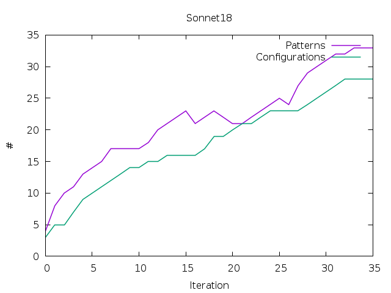
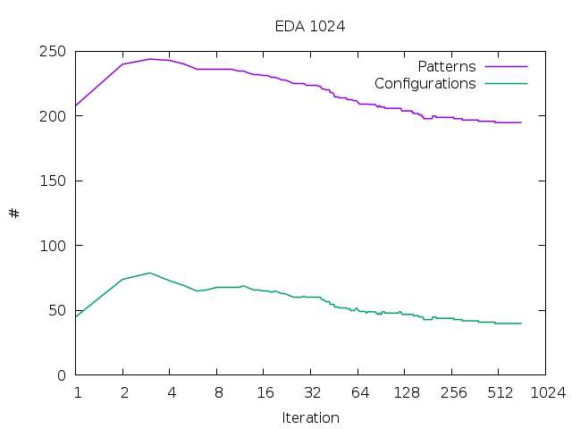
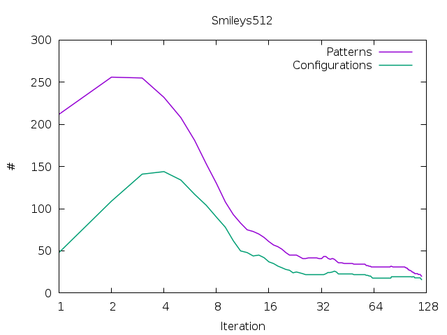
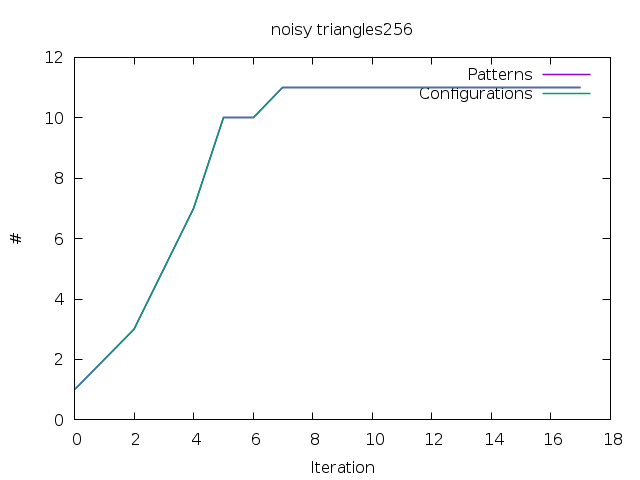
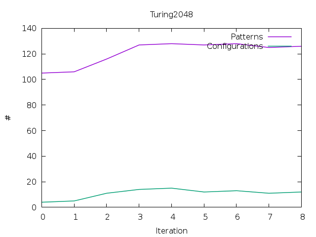
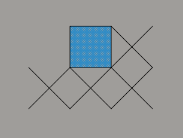

VOUW Project Journal
====================

## Patterns and configurations (updated 29-5-2019)

In a step towards the actual implementation of variants and noise tolerance, I have analysed one new component of the search space. Eventually, we want to be able to merge instances that are not strictly identical to the candidate. An example would be candidate `<X,Y,d>`. Normally we would merge all instances `\bar{X}` and `\bar{Y}` that are positioned by `d` relative to eachother. Suppose we also want to merge some `\bar{X}` with some `\bar{Z}` because `Z` is 'close' to `Y` and also at `d` relative to this `\bar{X}`. Apart from the problems that arise from judging if `Z` is indeed close to `Y`, I wanted to investigate what constraints can be imposed on `Z`.

One important consideration is if `Z` should be isomorphic to `Y`, or put differently, if they have elements at the same ppositions. If `Z` has the same amount of elements at the same offsets as `Y`, I say that `Z` and `Y` are of the same *configuration* (term maybe subject to future change, haha). It is important that they have the same configuration because otherwise patterns `X+Y` and `X+Z` would also have different configurations. This seems hard if not impossible to encode (but I may be wrong).

To asses whether the above constraint would yield any real-world possibilities in the search space, I have performed a small test where I plot the number of patterns and the number of configurations per iteration. If these number lie very close together, imposing aforementioned constraint would make it impossible to form variants later on. Ideally, we want their difference to be a factor of over two...







In the plots we can observe a similar trend for all datasets: the ratio patterns vs configurations is favorable in the beginning and declines towards the end (note that the plots use a log scale on both axes).


## Local search with flood-fill (updated 22-7-2019)

One of the local search methods that I have succesfully experimented with is 'flood fill'. The name simply comes from the simplistic 'paint bucket' or 'maze solving' algorithm that is conceptually identical to a breadth-first-search. The idea is that if we merge two patterns `X` and `Y` to form `Z`, that we could possibly expand on `Z` by looking at all its instances. The argument for why this should work, stems from the observation that the algorithm tends to build patterns by merging one singleton to an increasingly large pattern each iteration. Although this is simply the way the search heuristic works, it is less optimal then what could theoretically be achieved (the `n-1` versus `log(n)` complexity). Because we still want to exploit the `log(n)` possiblity, flood-fill is basically a way to temporarily circumvent the default global behavior.

After each iteration we have merged some `X` and `Y` into `Z` resulting in a set new of instances `\bar{Z}_0..\bar{Z}_n`. Normally, we would write these to the instance matrix directly. Flood-fill, on the other hand, for all instances `\bar{Z}_i` it builds a set of all instances in their peripheries, and the respective offsets relative to `\bar{Z}_i`. The intersection of all these sets gives us the neighboring instances `\bar{W}_0..\bar{W}_m` that all `\bar{Z}_i` have in common. From the assumption that the global search would eventually add the respective pattern `W` to `Z` anyway, we go ahead and merge `Z` and all `\bar{W}_0..\bar{W}_m`. Furthermore, we repeat this step on the resulting instances and only stop when the intersection of said sets is empty.

The above may seem like a radical proposition given that the global search is a carefully balanced system and strongly adheres to the MDL-principle of 'data mining by compression'. We can bring the MDL-equation back into the local search by only adding neighboring instances if the compression ratio improves. In practive, however, this yields near-identical results, reinforcing us to believe that taking this 'shortcut' does not radically alter the search space. Still, it is undeniable that flood-fill does change at least the order in which patterns are completed and therefore we need to make a more detailed analysis of the actual effect on the algorithm's performance.


## Theoretical complexity of patterns (updated 15-7-2019)

To determine the overall complexity of the algorithm, we need to look at the most complex operation. Candidate search is by far the most complex operation in VOUW and therefore we can measure theoretical performance by estimating how many times candidate search is performed in terms of input. It is 'easy' to give an upper bound for the number of searches, but that is not very usefull (and results in a very ugly factorial). Another way to look at the search complexity, is to use the size of the patterns we hope to find. Say that a dataset contains a pattern `X` of size `|X|`. It will for this pattern then take up to `|X|-1` iterations to be found. Assuming we use the 'Best 1' heuristic, an identical number of searches will have to be performed. The figure of `|X|-1` is the worst case scenario, assuming that `X` is formed by adding a singleton pattern to it on each iteration. (Notice that fortunately, the complexity is `|X|-1` regardless of how many times `X` occurs.)

In the best possible scenario it would only take `log(|X|)` iterations to form `X`. This would be equivalent to divide-and-conquer or first merging all singletons of `X` into patterns of size two, then merging those into patterns of size four, etc. This is an unlikely scenario as we pick the encoding in such way that a single large pattern is favoured over many smaller patterns (because fewer patterns are apparently a better description). In reality the number of iterations will lie very close to the worst case with the exception for patterns that contain another, smaller and more prevalent pattern `Y`. In that case, this `Y` will be discovered first after which some of the work for `X` is already done as a by-product.

As we cannot hope to improve the worst case situation at all, we may try to improve the average case. The previous paragraph suggests that the current behavior is a direct result of the 'MDL-way' of searching and cannot be changed. While this can indeed not be changed globally, we could try a local search method. One way to implement this is to look after each successfull merge if the resulting pattern belongs to a bigger and equally prevalent pattern. I will describe this method (flood-fill) later in greater detail. Another way to approach this idea is to globally limit the maximum size of patterns we are looking for, and gradually increase this limit. Theoretically this enables the algorithm to find smaller (sub)patterns first and use them as building blocks later to create larger patterns. Further experiments would be needed to show if this changes the search space in a positive way or not.  

## On alternative heuristics (updated 29-5-2019)

The general search heuristic that VOUW uses up until this point, is based on the typical greedy MDL-approach to always pick the candidate that results in the greatest reduction of the (two-part) MDL-equation. From here on I call this the 'Best 1' heuristic. As it name already implies, Best 1 picks only one candidate from the candidate selection process. Given that the candidate search is the bottleneck of the algorithm, we would ideally like to reuse as much information from it as possible. An obvious solution would be to try to merge as many candidates in one iteration as possible, the 'Best N' heuristic.

As soon as we merge a candidate, multiple instances are affected and the coding inherently changes as well. To be able to correctly judge what candidate to merge next, we would always have to rebuild the entire candidate list. We can, however, make assumptions about the remaining set of candidates in the list. Say for example that we find candidate `<X,Y,d>` to be the best candidate at some point. We then know that the usages of patterns X and Y are reduced and therefore the gain and usage of candidates containing X and Y changes too. So it is obvious that we cannot use those candidate without further computations. Say we ignore all candidates with X and Y from now on and select the next-best candidate `<Z,W,d>`. Patterns Z and W were not affected and the usage for `<Z,W,d>` is still valid. Its gain is not, because the total number of instances has changed since the last merge. However, if we were to compute the gain again, we would obtain the same ranking as before. Therefore we can safely pick `<Z,W,d>` as the next candidate knowing it is the best of the current list of candidates. Would we also have picked `<Z,W,d>` if we had completely rebuilt the candidate list? That is hard to answer, although it is very likely.  


## Amending the instance matrix data struture (updated 17-4-2019 )

In the current implementation the instance matrix is stored in a single array in lexicographical order. Traversing an array in order is usually very fast because of good locality and therefore lends itself quite well to the way we search for candidates and/or encode based on a given codetable. The problem is, however, that during candidate search we need to 'look around' the current instance in two dimensions. As we do not have this spatial information encoded in the array, we have to scan the array in the vicinity of the candidate instance. While this is still fast for small matrices, it becomes excessively slow when entire rows of the matrix do not fit in cache.

In light of the above issue and to accommodate for future improvements (flood-fill), I have expanded the array-based datastructure with a two-dimentional version of the instance matrix. I have picked a dictionary-of-keys representation for this, using std::unordered_map, however, future experiments may prove that other containers are better (options are: full-dense or CRS/CCS).

A dictionary-of-keys (theoretically) gives constant time access to any element we want to look up, which makes it potentially much faster to look in the neighborhood of an instance. The general search algorithm has to be changed to accommodate for this though. The current implementation uses the instance's bounding box to determine if another instance is adjacent. For the new implementation I introduce the concept of a pattern's 'periphery'. This periphery contains all indices in pattern-space of elements that are considered adjacent. I also distinguish between anterior and posterior periphery: elements that belong to instances that came either before or after in lexicographical order.

The periphery is constructed once for each pattern and uses the notion that each single element has 8 possible adjacencies. For the posterior periphery I have choosen the convention to use the W, SW, S and SE directions (north-east pointing towards (0,0), the see picture). This convention ensures that we see all combinations of instances just once. When the pattern-space coordinates from the periphery are transformed into (instance)matrix-space coordinates we can easily use the dictionary-of-keys to obtain the respective instances.



For the implementation I debated whether to use heap-allocation for the instances and store their pointers in both the instance vector and the dictionary-of-keys, or, allocate all instances in an array and only store indices. I denote these with (b) and (c) respectively, the old implementation is (a). In the table below I have listed three experiments with all three implementations.

| Test set              | Patterns | Iterations | Time          | Time per iteration |
|-----------------------|---------:|-----------:|--------------:| ------------------:|
| noisytriangles512  (a)|       24 |         27 |        11.9 s |                    |
| noisytriangles512  (b)|       24 |         31 |         1.8 s |                    |
| noisytriangles512  (c)|       24 |         31 |         1.6 s |                    |
| smileys512 (a)        |       18 |        982 |        21.5 s |                    |
| smileys512 (b)        |       24 |        967 |         1.8 s |                    |
| smileys512 (c)        |       24 |        974 |         2.2 s |                    |
| turing2048 (a)        |        ? |          ? |        ~60 h  | 4600 ms            |
| turing2048 (b)        |       31 |       5419 |        76 min | 846 ms             |
| turing2048 (c)        |       31 |       5044 |        60 min | 719 ms             |

For the smaller matrices the difference in performance is already quite noticeable. I had to create a new, larger example (turing2048, a 2048x2048 image) to outline the enormous difference in scaling behaviour. Furthermore it appears that the index-based implementation is slightly faster than the pointer-based version, which is not all that suprising as the pointer indirection is time-consuming and hinders some compiler optimizations (the difference is very small though!). 

## Encoding, current state of affairs (updated 8-4-2019)

In the current encoding schema I encode the model H (set of patterns) separately from the data given the model D|H (instance matrix Hbar) with two different coding schemes. The instance matrix is encoded using the prequential plug-in code (derivation in draft paper), while I use the universal prior and the uniform distribution for encoding the model. 

In order to make the computation of the prequential plug-in code as fast as possible, I have rearranged the formula in a way such that only simple logarithms of the gamma function remained. To compute this in the actual code I use LIBC's `lgamma()`, which I divide by `log(2)` in order to obtain the log2gamma. The actual equation then looks like this:

```
L( D|H ) =
    log2gamma( |Hbar| + epsilon * |H| ) - log2gamma( epsilon * |H| ) +
    [ -log2gamma( U(X) + epsilon ) + log2gamma( epsilon ) ] forall X in H
```

The model is computed fairly easily by first encoding the total number of patterns and then encoding each pattern.

```
L( H ) = L_N( |H| ) + L( X ) forall X in H
```

For each pattern we encode the string of elements plus the binomium of the total number of elements over the number of non-empty elements. This way we effectively enumerate all possible ways `|X|` non-empty elements can be distributed over the bounding-box of the pattern.

```
L( X ) =
    log2( M ) + log2( N ) + binom( width*height, |X| ) +
    log2( b-1 ) * |X|
```

Note how I changed the equation to use M and N (the dimensions of the input matrix) to uniformly encode the pattern's bounding box as opposed to using the universal prior (which may give undue penalty to larger patterns). Another change I made is that the last term (log2(b-1) * |X|) effectively disappears when the matrix is binary. This work in all cases because we treat one value as the empty value anyway.

Given this knowledge, the binomium term could also effectively be replaced by adding the empty value back to the uniform distribution. The length function for patterns would then look like this:

```
L( X ) =  log2( M ) + log2( N ) + log2( b ) * |X|
```

This change makes the algorithm continue slightly longer on small matrices, however, sparse patterns are not penalized in this way. Whether or not this is a problem remains to be seen. All in all the subjective quality of the results differ very little with either method as the algorithm still 'stops too soon'.

## (Re-)encoding with a given codetable (updated 4-3-2019)

When a dataset is encoded using a given codetable, certain decisions have to be made during this process. There is often more than one possiblity for 'fitting' patterns to a dataset and choices made here can affect the compression ratio dramatically. One example is that if patterns are greedily placed to cover a dataset, previously placed patterns might be 'in the way' of placing a (possibly better fitting) pattern at a location that would otherwise give a good description of the data.

The current commit of VOUW includes a simplistic encoding scheme that applies the mined codetable (again) to the same data. It thus regenerates the instance matrix from scratch with an existing codetable, let us call it 're-encoding'. Currently, I use an heuristic that first tries to fit the largest pattern in as many instances as possible, then the second-largest etc. This heuristic makes sense from a compression point-of-view, because large patterns reduce the size of the instance matrix. 

One of the ideas was to replace the algorithmic pattern/instance merging with a re-encode step each iteration. This would then hopefully prevent the small-pair-preference artifact to occur and would lead to a more repoducible result. Some simple tests indicated an (expected) performance degradation of a factor 100-500. However, the results did not benefit in the expected way. The small-pair-preference problem disappears in some instances, but not in others. The main reason for this is that the candidate search does not 'see' the possiblities that are created afterwards by the re-encoding step. 

Re-encoding might still be key to the encoding process, but perhaps not for every iteration. I did some tests with re-encoding after the normal algorithm has run its course (thus as a refinement step after encoding). I have tested this on the noisy_triangles example, of which I have also created larger version (with equal patterns and noise). As we had expected, the large versions encode marginally better, probably due to the fact that MDL works poorly on very small datasets.

| Test set              | Ratio   | Patterns | Iterations | Time          | Subjective quality |
|-----------------------|--------:|---------:|-----------:|--------------:| -------------------|
| noisytriangles64      | 96.7%   | 12       | 9          | 34 ms         | Mediocre           |
| noisytriangles64 *    | 96.6%   | 13       |            |               | Same as above      |
| noisytriangles256     | 98.0%   | 17       | 23         | 1531 ms       | Mediocre           |
| noisytriangles256 *   | 97.6%   | 14       |            |               | Slightly better    |
| noisytriangles512     | 97.6%   | 24       | 25         | 12469 ms      | Mediocre           |
| noisytriangles512 *   | 97.4%   | 18       |            |               | Much improved      |

The entries with * have been re-encoded as a refinement step. Note that due to the noisy nature of the tests, the compression ratio looks not very good, but the signal-to-noise ratio is actually quite impressive (we should develop an additional metric for this). We can clearly see that the re-encoded datasets improve in subjective clarity as well as the number of patterns needed to describe the dataset, whilst improving the ratio. 

## Status quo up to February 2019 (updated 24-2-2019)

In order to assess uncoming modifications, I decided to benchmark and report on the current sitution first. I will briefly decribe the components of the algorithm with their current implementation decisions.

- Candidate search. Lots of effort went into making this fast. Currently, we search for pairs *p1* and *p2* occuring in the instance list. Each pair is hashed so that we can quickly count multiple occurences as we go through the list. The main output of the candidate search is for all pairs *p1,p2* their current usage. One big problem is that if *p1=p2*, we can get all kinds of weird artifacts that lead to double counting. To combat this (and have exact gain computation) each time we count identical patterns, I compute their spatial configuration in what I call an *overlap coefficient*. This coeffecient is stored efficiently in a bitvector of the instance belonging to *p2*. When we later detect the same configuration in some instance belonging to a *p1*, we know we have already seen this thing shifted by one. Thus we ignore this occurence.
- Gain computation. In this step we compute gain for all candidates depending on their usage. Currently the computation is exact, so we need to do a lot of steps to get it right, because merging two patterns changes the entire codetable and all its codelengths. It is algebraically optimized such that little computations are needed and is therefore generally the fastest step.
- Merge the candidate. Here we simply merge the two patterns from the best candidate and replace all instances of the separate patterns with the same configuration, with the newly created pattern. This operation can account for a third of the computation time, depending on the usage of the new pattern. Effort decreases exponentially near the end because the instance matrix becomes much smaller.
- Pruning. Pruning can either be the pruning of zero-use patterns or the decomposition of used patterns. The latter is very complex and although it takes little time, it has not (yet) proven to be very usefull. 

### Shortcomings

The current approach is reasonably fast, but has several shortcomings. The most important are: (1) the encoded result during the process is not the same as when one would encode the input matrix with the same codetable from scratch, (2) there is no noise-rebustness and (3) an unwanted artifact occurs that leads to sub-optimal encodings that I call *small-pair preference.*

### Small-pair preference

This artifact is a result of taking shortcuts when merging the best candidate patterns. Say we have two strings of elements over the alphabet *1,2*:
```
1 2 1 2 1 2
1 2 1 2 1
```
We ignore the horizontal relation for a moment here. One would expect to find `1 2 1 2 1` twice along a lone `2` in the first string. However, we will in fact find five patterns `1 2` with a lone `1` in the second string. We could solve this problem by re-encoding the entire input matrix at every step. However, this would mean our gain computation is off as well as slow down each step considerably.

### Benchmark

These tests provide some insight into the current performance of the algorithm. These tests are not representative of any real-world problem nor are they particulary robust. I do hope they give some baseline to compare future solutions to. 

| Test set              | Ratio   | Patterns | Iterations | Time          | Subjective quality |
|-----------------------|--------:|---------:|-----------:|--------------:| -------------------|
| triangles32_32        | 43.14%  | 5        | 10         | 3 ms          | Excellent          |
| sonnet18              | 17.87%  | 41       | 258        | 1857 ms       | Good               |
| smileys512            | 8.586%  | 21       | 943        | 21505 ms      | Mediocre           | 
| rule73rand            | 39.64%  | 30       | 85         | 193 ms        | Excellent          |
| shapes40              | 31.82%  | 10       | 106        | 106 ms        | Good               |
| checkboard256         | 2.542%  | 3        | 16         | 401 ms        | Mediocre           |
| noise512              | -       | -        | -          | -             | Crash              |
| noisytriangles64      | 97.2%   | 14       | 7          | 23 ms         | Mediocre           |
| smallpair16           | 71.12%  | 6        | 9          | 2 ms          | Mediocre           |
| rulers32              | 93.64%  | 8        | 8          | 4 ms          | Mediocre           |

All tests were performed with 8 quantization levels and 'show progress' unchecked for unbiased timings. Note that the last three tests were especially crafted to make the current algorithm perform at its worst.
